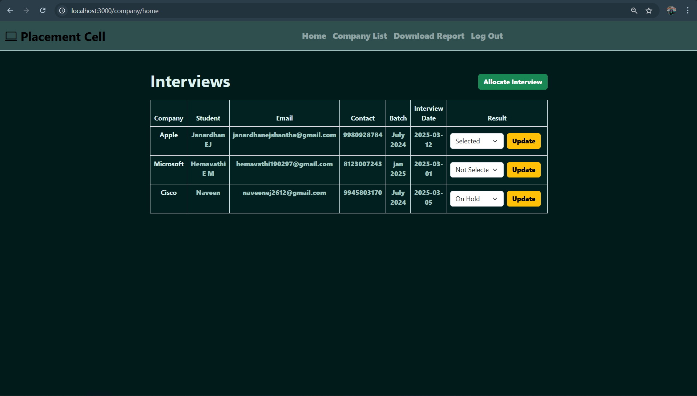

# Placement Cell Application

Placement Cell Application is a full-stack web app which allows employees to manage student details, course scores and interview results. Employees can schedule interviews, mark results and export data to CSV for reporting.


## Live Demo
Link: https://janardhanej1906-placement-cell.onrender.com/users/signin


## Features Implemented

- **Sign-up/Register**: Create an account using your name, email and password.
- **Sign-in/Log In**: Securely log into your account using your email and password.
- **Sign Out/Log Out**: Log out of your session.
- **List of Students + Add New Student** – Employees can view a list of students and add new students with details like name, college, batch and scores.
- **List of Interviews + Schedule Interview (Allocate Student to Interview)** – Employees can view a list of interviews and schedule new interviews with a company name and date. Employees can allocate students to specific interviews.
- **Mark Interview Result** – From the interview page, employees can mark the result status for each student (SELECTED, NOT SELECTED, ON HOLD, PENDING).
- **Download CSV** – Employees can export all student and interview data into a CSV file.


## Environment Variables

Before running the application locally, create a .env file at the root of your project and configure the following environment variables:

1. **PORT**: Port number the application will listen on.
2. **DB_URL**: MongoDB database connection URL String.

Ensure all values are correctly set before starting the application.

**Example `.env` file:**
```plaintext
PORT=3000
DB_URL=mongodb://localhost:27017/authdatabase 
```


## Dependencies/technologies 

The project leverages the following Node.js dependencies and technologies:
- Express.js
- MongoDB or mongoose
- Passport.js 
- bcrypt 
- express-session
- express-ejs-layouts
- dotenv
- fastcsv 


## How to Use:

Follow these steps to run the project locally:
1. Clone the repository: git clone https://github.com/JanardhanEJ/janardhanej1906-placement-cell.git
2. Navigate into the project directory: 
   cd janardhanej1906-placement-cell
3. Install dependencies:
   npm install
4. Start the project by below command:
   node index.js
5. Open your web browser and visit http://localhost:3000 to access the application.


## Screenshots: (taken locally)
1. Open your web browser and go to http://localhost:3000/user/signin
You will see a login page like this:


## 2. Sign Up/Register
a) If you don’t have an account, click on the Register link.
Fill in all the required details and click on the Register button.
eg: 

b) Few common errors while Signing Up:


c) Sample database entry:


## 3. Sign/Log In
Use the same email and password used during registration and click on the Sign In button.
Example: 

a) If the entered details match, you will be redirected to the homepage:


## 4. Sign/Log Out
After a successful login, you can Log out by clicking on the Log Out button.
After signing out, you will be redirected to login page like this:


## 5. Add Student
Click on the Add Student button from home page. Fill in all the required student details, then click on the Create Student button.


## 6. List of Students
After adding the student details, the Home page will display a list of all student details like this:


Sample database entry:


## 7. Schedule Interview (Allocate Student to Interview)
Click on the Allocate Interview button from the Company List page (navigation bar). Fill in all the required details, such as the company name, date, and allocate the student to the specific interview schedule.


After adding details, company's details are stored in Database


## 8. List of Interviews
After adding the interview details, the Company List page will display a list of all student's interview details like this:


## 9. Mark Interview Result
Employees can mark the interview result of a particular student with options like Selected, Not Selected, On Hold, and Pending (default option). After selecting the result, they need to click on Update to save it to the database.


## 10. Download CSV
Employees can export all student and interview data into a CSV file by clicking the Download Report link from the navigation bar. The CSV file will be generated and downloaded to your local system, allowing you to view, browse, and analyze the details.


## 11. List of Students after allocating interview


## 12. Delete Student Details
You can delete student details by clicking the Delete button in the Action row on the Home page where all student details are listed.
The image below shows the updated list after deleting the details of Naveen Student 


